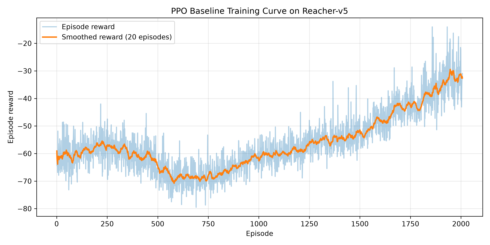
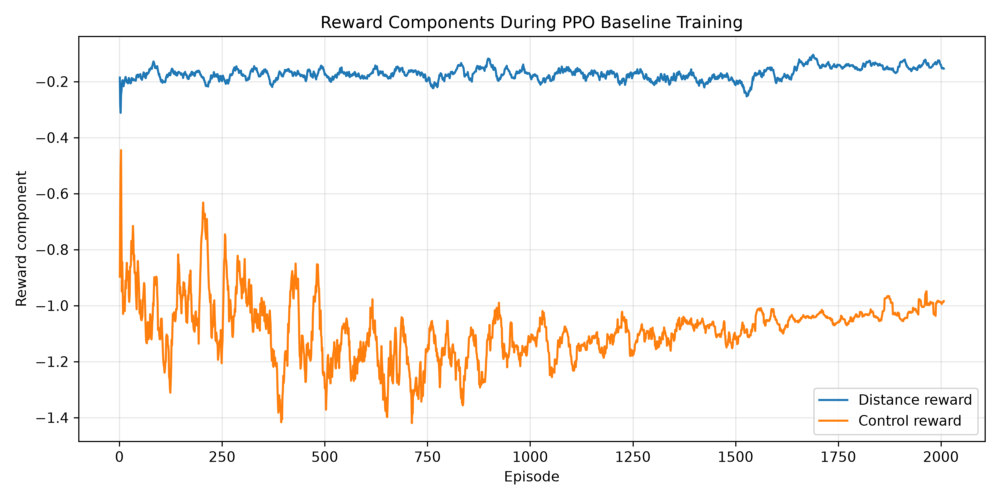
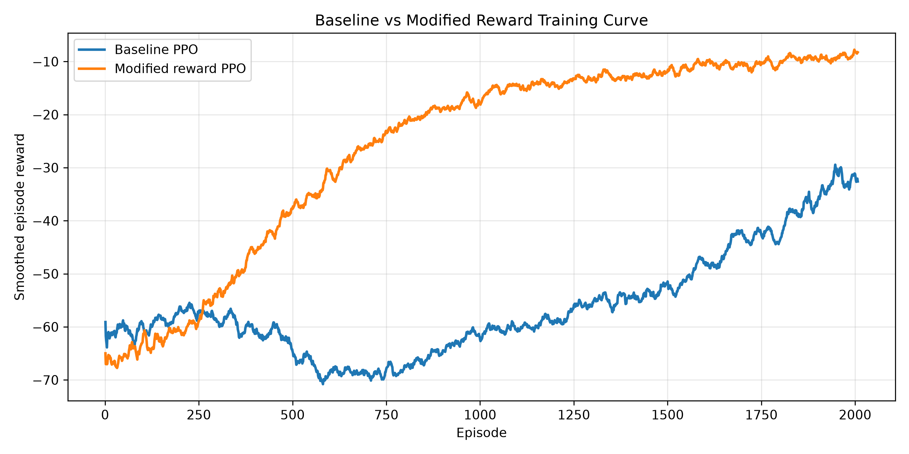
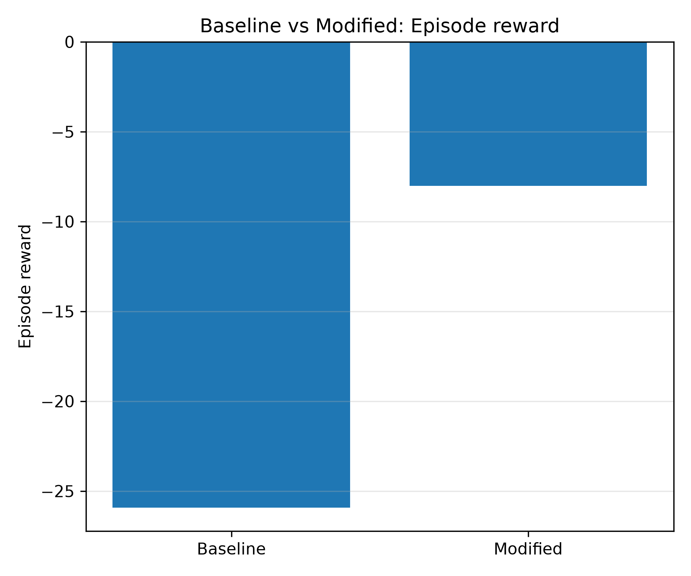
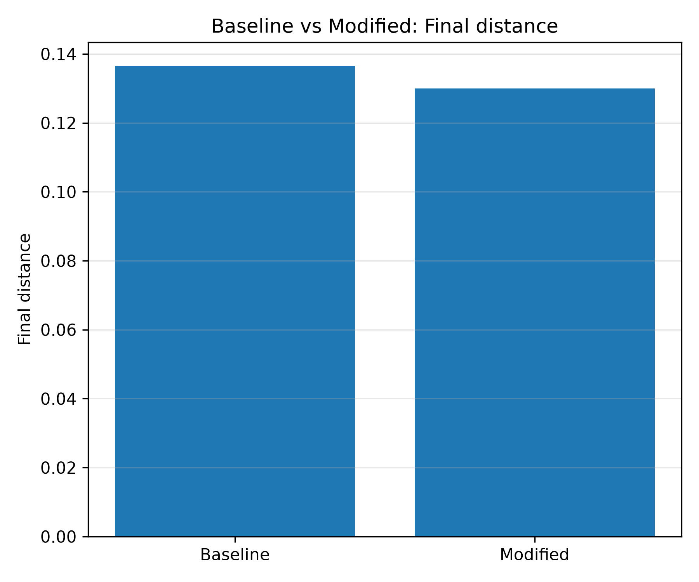
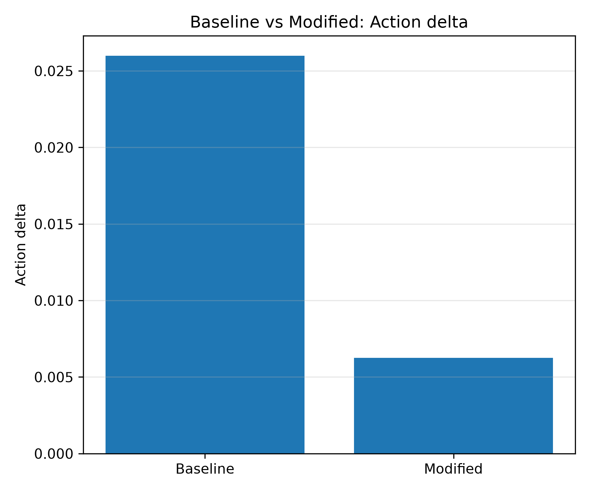
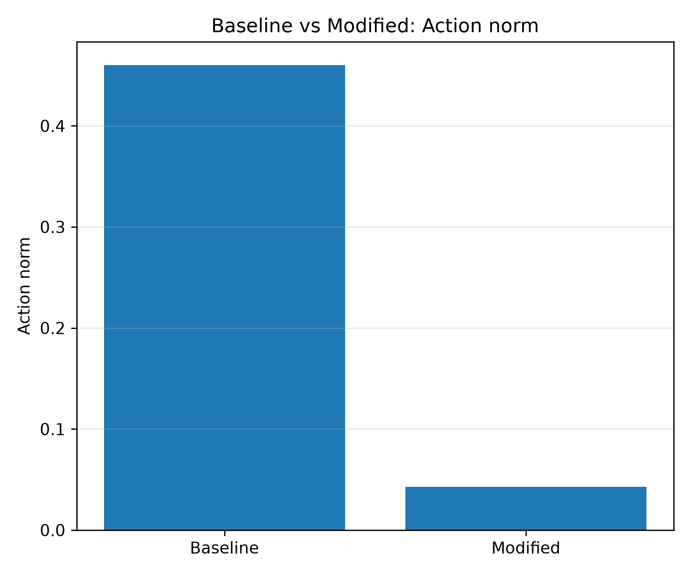

# MuJoCo-Based Reinforcement Learning Control for Reacher-v5

This project reproduces and analyzes a robotic reinforcement learning control task using **MuJoCo**, **Gymnasium**, and **Stable-Baselines3**. The main environment is `Reacher-v5`, where a two-link robotic arm learns to move its end-effector toward a target point.

The project includes a PPO baseline, a modified reward design with an action smoothness penalty, training curve visualization, policy rollout visualization, baseline-vs-modified evaluation, and zero-action/random-action sanity checks.

---

## Project Overview

The goal of this project is to study how reinforcement learning can be used for continuous robotic control.

In the `Reacher-v5` environment:

- The agent observes the current robot state and target-related information.
- The policy outputs continuous control actions for two robot joints.
- The MuJoCo simulator updates the robot dynamics.
- The environment returns a reward based on target-reaching performance and control effort.

The overall control loop is:

```text
observation -> PPO policy -> joint action -> MuJoCo simulation -> reward -> policy update
```

This project focuses on both task performance and control behavior. Besides training a PPO policy to reach the target, it also analyzes action smoothness and control magnitude.

---

## Environment

The main environment is:

```python
gymnasium.make("Reacher-v5")
```

The checked observation and action spaces are:

```text
Observation space: Box(-inf, inf, (10,), float64)
Action space: Box(-1.0, 1.0, (2,), float32)
```

The 10-dimensional observation includes robot joint information, target-related information, joint velocities, and the relative position between the end-effector and the target.

The action is a 2-dimensional continuous control input:

```text
action = [joint1_control, joint2_control]
```

Each action component is bounded between `-1` and `1`.

---

## Reward Function

The original Reacher-v5 reward can be interpreted as:

```text
reward = reward_dist + reward_ctrl
```

where:

```text
reward_dist = - distance between end-effector and target
reward_ctrl = - control cost
```

Therefore, a better policy should:

- move the end-effector closer to the target;
- avoid unnecessarily large control actions.

The reward is usually negative. A value closer to `0` indicates better performance.

---

## Modified Reward Design

The baseline policy can learn target-reaching behavior, but it may use relatively aggressive or visually unnatural control actions. To encourage smoother control, this project adds an action smoothness penalty:

```text
modified_reward = original_reward - lambda_smooth * ||a_t - a_{t-1}||^2
```

where:

```text
a_t           = current action
a_{t-1}       = previous action
lambda_smooth = smoothness coefficient
```

In this project:

```text
lambda_smooth = 0.05
```

The purpose of this reward modification is to encourage smaller and smoother action changes while still maintaining target-reaching performance.

---

## Method

The project uses **Proximal Policy Optimization (PPO)** from Stable-Baselines3.

Main PPO configuration:

```text
Policy: MlpPolicy
Learning rate: 3e-4
n_steps: 2048
batch_size: 64
n_epochs: 10
gamma: 0.99
gae_lambda: 0.95
clip_range: 0.2
total_timesteps: 100,000
```

Because Reacher-v5 uses low-dimensional state observations instead of images, an MLP policy is used rather than a CNN policy.

---

## Project Structure

```text
rl-mujoco-reacher/
│
├── scripts/
│   ├── check_env.py
│   ├── random_rollout.py
│   ├── train_baseline.py
│   ├── plot_training_curve.py
│   ├── rollout_baseline.py
│   ├── train_modified_reward.py
│   ├── compare_baseline_modified.py
│   ├── rollout_policy.py
│   └── evaluate_zero_random.py
│
├── figures/
│   ├── baseline_reward_curve.png
│   ├── baseline_reward_components.png
│   ├── baseline_vs_modified_training_curve.png
│   ├── comparison_mean_episode_reward.png
│   ├── comparison_mean_final_distance.png
│   ├── comparison_mean_action_delta.png
│   └── comparison_mean_action_norm.png
│
├── logs/
│   └── ignored by Git
│
├── models/
│   └── ignored by Git
│
├── results/
│   └── ignored by Git
│
├── requirements.txt
├── .gitignore
└── README.md
```

The trained models, logs, and result CSV files are not uploaded to GitHub by default. They can be regenerated by running the training and evaluation scripts.

---

## Installation

Create and activate a conda environment:

```bash
conda create -n rl-mujoco python=3.11 -y
conda activate rl-mujoco
```

Install PyTorch with CUDA support:

```bash
python -m pip install torch torchvision torchaudio --index-url https://download.pytorch.org/whl/cu128
```

Install the remaining dependencies:

```bash
python -m pip install "gymnasium[mujoco]" "stable-baselines3[extra]" tensorboard matplotlib pandas numpy tqdm rich imageio imageio-ffmpeg jupyter ipykernel
```

Alternatively, install from `requirements.txt`:

```bash
python -m pip install -r requirements.txt
```

This project was tested with:

```text
Windows 11
Python 3.11
PyTorch 2.11.0+cu128
Gymnasium / MuJoCo
Stable-Baselines3
NVIDIA GeForce RTX 5070 Ti
```

For this low-dimensional MLP control task, CPU execution is usually sufficient. GPU acceleration is not required.

---

## Environment Check

Run:

```bash
python scripts/check_env.py
```

Example output:

```text
PyTorch version: 2.11.0+cu128
PyTorch CUDA version: 12.8
CUDA available: True
GPU name: NVIDIA GeForce RTX 5070 Ti

Observation space: Box(-inf, inf, (10,), float64)
Action space: Box(-1.0, 1.0, (2,), float32)
Initial observation shape: (10,)
```

This confirms that PyTorch, Gymnasium, MuJoCo, and the Reacher-v5 environment are working correctly.

---

## Training

### Train PPO Baseline

```bash
python scripts/train_baseline.py --total-timesteps 100000 --device cpu
```

The final baseline model is saved to:

```text
models/baseline/ppo_reacher_baseline_final.zip
```

### Train PPO with Modified Reward

```bash
python scripts/train_modified_reward.py --total-timesteps 100000 --smooth-coef 0.05 --device cpu
```

The final modified-reward model is saved to:

```text
models/modified_smooth_0.05/ppo_reacher_modified_final.zip
```

---

## Policy Rollout Visualization

### Random Policy

```bash
python scripts/random_rollout.py
```

### Baseline PPO Policy

```bash
python scripts/rollout_policy.py --policy baseline --num-episodes 3 --seed-start 100 --delay 0.05
```

### Modified-Reward PPO Policy

```bash
python scripts/rollout_policy.py --policy modified --num-episodes 3 --seed-start 100 --delay 0.05
```

The rollout script prints episode reward, final distance to target, mean action delta, and mean action norm.

Example baseline rollout:

```text
Episode 1 | seed = 100 | reward = -23.684 | final distance = 0.2078 | mean action delta = 0.02542 | mean action norm = 0.38634
Episode 2 | seed = 101 | reward = -33.221 | final distance = 0.1728 | mean action delta = 0.02575 | mean action norm = 0.54506
Episode 3 | seed = 102 | reward = -22.197 | final distance = 0.0579 | mean action delta = 0.02611 | mean action norm = 0.42747
```

Example modified-reward rollout:

```text
Episode 1 | seed = 100 | reward = -2.432 | final distance = 0.0249 | mean action delta = 0.00189 | mean action norm = 0.01196
Episode 2 | seed = 101 | reward = -7.938 | final distance = 0.1321 | mean action delta = 0.00815 | mean action norm = 0.04888
Episode 3 | seed = 102 | reward = -6.634 | final distance = 0.1216 | mean action delta = 0.00289 | mean action norm = 0.02110
```

---

## Training Curve Visualization

Generate the baseline training curve:

```bash
python scripts/plot_training_curve.py
```

Compare baseline and modified-reward policies:

```bash
python scripts/compare_baseline_modified.py
```

---

## Baseline PPO Result

After 100,000 timesteps, the baseline PPO policy achieved:

```text
Mean reward over 20 episodes: -25.742
Std reward over 20 episodes: 3.617
```

The baseline training curve shows that episode reward improved from around `-60 / -70` in the early stage to around `-30` after training.



The reward component plot shows the distance-related and control-related reward terms recorded during training.



---

## Baseline vs Modified Reward

Both policies were evaluated using the same 20 test seeds under the original Reacher-v5 reward. This ensures that the baseline and modified policies face the same target positions and initial conditions.

| Policy | Mean Episode Reward | Std Episode Reward | Mean Final Distance | Mean Action Delta | Mean Action Norm |
|---|---:|---:|---:|---:|---:|
| Baseline PPO | -25.929 | 4.086 | 0.1366 | 0.0260 | 0.4601 |
| Modified Reward PPO | -8.005 | 2.861 | 0.1300 | 0.00625 | 0.0430 |

The modified-reward policy achieved a higher original Reacher-v5 return while maintaining a similar final distance to the target. It also significantly reduced both the mean action delta and the mean action norm.

This suggests that the modified reward encouraged smoother and lower-magnitude control actions without degrading target-reaching performance in this experiment.











---

## Zero-Action and Random-Action Sanity Check

A zero-action sanity check was added to verify whether the modified-reward policy simply learned to avoid control effort by staying still.

| Policy | Mean Episode Reward | Std Episode Reward | Mean Final Distance | Mean Final Control Cost |
|---|---:|---:|---:|---:|
| Random Action | -41.853 | 3.140 | 0.1777 | 0.5159 |
| Zero Action | -12.484 | 4.297 | 0.2497 | 0.0000 |
| Modified Reward PPO | -8.005 | 2.861 | 0.1300 | approximately 0 |

The zero-action policy achieved zero control cost, but its final distance to the target was much larger than that of the modified-reward policy.

This indicates that the modified policy did not simply learn to stay still. Instead, it learned a more conservative but still effective reaching behavior with much smaller control actions.

---

## Key Observations

1. The PPO baseline successfully learned a target-reaching behavior in Reacher-v5.
2. The baseline policy used relatively large control actions, which resulted in high control penalties.
3. Adding an action smoothness penalty encouraged smaller and smoother control actions.
4. Under the same evaluation seeds, the modified-reward policy achieved better original reward and much lower action magnitude.
5. The zero-action sanity check confirmed that the modified policy was not simply staying still.
6. The modified-reward policy learned a more conservative control behavior while still improving target-reaching performance.

---

## Limitations

This project is a small-scale reproduction and analysis study. The results are based on one MuJoCo environment and limited training timesteps.

Potential improvements include:

- training with multiple random seeds;
- using longer training schedules;
- tuning PPO hyperparameters;
- comparing with SAC or TD3;
- adding posture or joint-configuration penalties;
- recording rollout videos or GIFs;
- visualizing end-effector trajectories;
- evaluating policies across more target distributions.

---

## Conclusion

This project demonstrates a complete reinforcement learning workflow for robotic control in MuJoCo:

```text
environment setup
-> PPO baseline training
-> reward modification
-> training curve analysis
-> policy rollout visualization
-> baseline-vs-modified evaluation
-> zero-action sanity check
```

The modified reward design significantly reduced action magnitude and action variation while maintaining effective target-reaching performance in Reacher-v5.

Overall, this project shows how reward design can affect both task performance and control behavior in robotic reinforcement learning.